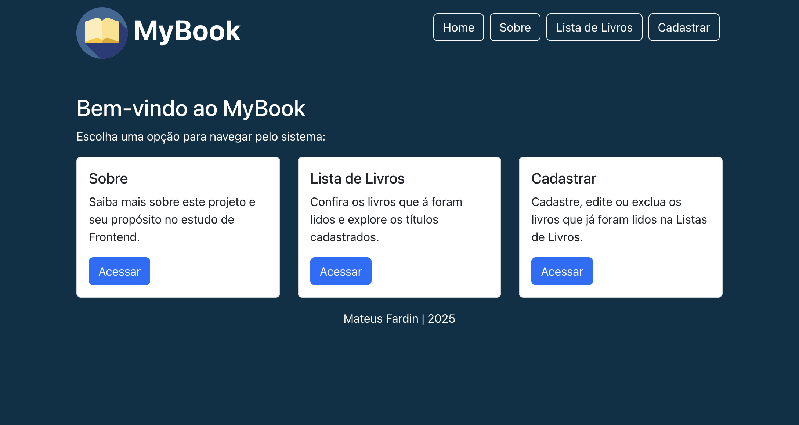

# Nome do Aluno: Mateus Fardin

## 📖 Sobre o Projeto
Este projeto foi desenvolvido como parte da disciplina de **Desenvolvimento Frontend** no curso de **Análise e Desenvolvimento de Sistemas** da **Pontifícia Universidade Católica do Rio Grande do Sul (PUC-RS)**.

O **MyBook** é uma aplicação web que permite o gerenciamento de livros lidos. Ele foi desenvolvido utilizando **React**, com foco na criação de componentes reutilizáveis, gerenciamento de estado e navegação dinâmica.

O projeto foi realizado por **Mateus Fardin** como parte do aprimoramento das habilidades em desenvolvimento web.

---

## 🎯 Objetivos
- Explorar conceitos fundamentais do **React**
- Implementar **gerenciamento de estado** para manipulação de dados
- Criar componentes reutilizáveis e organizados
- Trabalhar com **eventos e manipulação de formulários**

---

## 🛠️ Tecnologias Utilizadas
Este projeto foi desenvolvido utilizando as seguintes tecnologias:

- **React**: Framework para construção de interfaces dinâmicas
- **Bootstrap**: Estilização e layout responsivo
- **JavaScript**: Manipulação de estado e eventos
- **HTML5 & CSS3**: Estrutura e design da aplicação

---

## 📂 Estrutura do Projeto

```
mybook/
│── src/
│   ├── components/
│   │   ├── header/
│   │   │   ├── Header.js
│   │   │   ├── NavBar
│   │   │       ├── NavBar.js
│   │   ├── content/
│   │   │   ├── Content.js
│   │   │   ├── Home.js
│   │   │   ├── Sobre.js
│   │   │   ├── BookForm.js
│   │   │   ├── BookList.js
│   │   ├── footer/
│   │   │   ├── Footer.js
│   ├── App.js
│   ├── index.js
│── public/
│── package.json
│── README.md
```

---

## 🚀 Como Executar o Projeto

### 🔧 Pré-requisitos
Antes de começar, você precisa ter instalado em sua máquina:
- [Node.js](https://nodejs.org/) (versão recomendada: LTS)
- [Git](https://git-scm.com/) (para clonar o repositório, opcional)

### 📥 Passo a Passo

1️⃣ **Clone o repositório:**
```sh
  git clone https://github.com/seu-usuario/mybook.git
```

2️⃣ **Acesse a pasta do projeto:**
```sh
  cd mybook
```

3️⃣ **Instale as dependências:**
```sh
  npm install
```

4️⃣ **Inicie o servidor de desenvolvimento:**
```sh
  npm start
```

📌 O projeto será aberto no navegador no endereço: `http://localhost:3000`. Este é o resultado esperado:



---

## 📌 Organização das Páginas
- **Home:** Página inicial com acesso rápido às funcionalidades.
- **Sobre:** Informações sobre o projeto.
- **Lista de Livros:** Exibe os livros cadastrados.
- **Cadastrar:** Permite adicionar, editar ou excluir livros.

---

## 🏗️ Estrutura dos Componentes
- **Header:** Contém o nome do projeto e o menu de navegação.
- **NavBar:** O próprio menu de navegação, em formato de botões.
- **Content:** Gerencia a exibição das páginas sem recarregar a aplicação.
- **BookForm:** Formulário para adicionar e editar livros.
- **BookList:** Lista todos os livros cadastrados.
- **Footer:** Rodapé simples com a autoria do projeto.

---

## 📌 Melhorias Futuras
- Implementar um banco de dados para persistência dos livros (próximas disciplinas do curso, imagino).
- Melhorar a acessibilidade do menu de navegação (converter os botões para nav links).
- Adicionar um sistema de busca e filtragem de livros.
- Repensar a exibição da página de formulário em duas colunas.

---

## 📜 Licença
Este projeto é de código aberto e pode ser utilizado para fins educacionais.

---

**PUC-RS | Disciplina de Desenvolvimento Frontend** | Feito por **Mateus Fardin**
